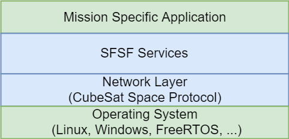
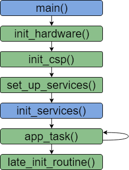
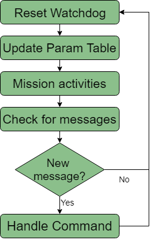

SmallSat Flight Software Framework
=============================

## Introduction

SFSF of (SF)^2 states for SmallSat Flight Software Framework, which is a small software framework aimed to help CubeSat student projects with the development of the flight software. It consists of a bunch of services and functions, which can be used for rapidly developing the flight software. The framework is open source and was developed during 2018 by the GW-CubeSat team, thanks to the cooperation between [SETEC Lab](https://www.facebook.com/SETECLab/) and [MpNL](https://mpnl.seas.gwu.edu/).

## Framework Architecture 

The framework itself is composed of two software libraries. One is [CubeSat Space Protocol](https://github.com/libcsp/libcsp) (CSP), which is an open-source library developed by a group of students from Aalborg University, this library offers functions for communication, like sending and receiving messages between satellite and ground stations. 

The other library is the [SFSF Services](#sfsf-services), which are a bunch of useful functions, which can be used for rapidly developing the flight software for CubeSats. This second library is dependent from CSP, in other words, the SFSF Services require functions from CSP to work, however, CSP can work without the SFSF Services. 

A better way to explain this relationship is by calling the libraries as *layers*. So we can stack layers, by placing the less dependent library at the bottom, above this we can place the library that depends on the first library. Following this logic, the framework can be illustrated in the following figure. So if we remove the layer on top, the underlying layer can still prevail. However, if we remove the layer at the bottom, the layer on top cannot prevail, because it is dependent. 

To build a CubeSat flight software, it is necessary to include other two software layers, an Operating System (OS) and an Application. CSP is actually no completely independent, in fact, this library depends on an OS, which provides functionalities for creating, synchronizing and communicating tasks. Therefore we can say that the OS layer is located below CSP. Examples of OS are Linux, Windows, FreeRTOS, RETEMS. The framework was designed to work with different OSs, so that the same flight software can be executed in a Desktop computer with Linux, but also in an embedded system with FreeRTOS. This feature is called portability and will be discussed further in section [Porting the Framework](#port). This is the reason why the OS is initially not part of the framework, and it has to be chosen and included by the team developing the flight software. 

Finally, on top of the three previously mentioned layers, is located the Application layer. This makes use of the functions from the three underlying layers, to conduct the mission according to what is required. The Application is the "smart" section of the flight software because this knows how to respond to commands and perform the mission activities. The Application is unique for each CubeSat mission because each mission has different goals, therefore this section is the responsibility of the team developing the CubeSat mission. 

 

## Framework Organization 
The framework organization is very simple, each layer is contained in its own directory. The directory [*app*](app/) contains the code of the Application layer. The directory [*libcsp*](libcsp/) contains the code of CSP, the network layer. 
The directory [*libsfsf*](libsfsf/) contains the code of the SFSF services. The directory [*docu*](docu/) contains the required files for generating the documentation with Doxygen. Finally, the directory [*examples*](examples/) contain an application example. 

|	Directory  |	Content                              |
|---------------|-----------------------------------|	
|  app 			  |	Application Files		        |
|  libcsp		  |	CubeSat Space Protocol 	|
|  libsfsf	 	  |  	SFSF Services			            |
|  docu		  | 	Documentation 			    |
|  examples |	    Example	Applicaton	    		|

## Documentation 
Each API file from the SFSF Services (files in the *include* directory), contains its own documentation, as comments in the source code. 

A more interactive HTML documentation can be generated using Doxygen. For this download the [Doxygen tool](http://www.stack.nl/~dimitri/doxygen/download.html). Open the file *Doxyfile* located at the *docu* directory with the tool, then on the tab *Run*, hit the *Run Doxygen* button. Or run Doxygen with the terminal as:
~~~~
doxygen Doxyfile
~~~~
The documentation will be generated into the *docu* directory in a new directory called *html*. Open the file *index.html* with a Web Browser to visualize it. 

A PDF file with the same documentation is also included in the *docu* directory, but the HTML version is recommended.

## Example	
The folder *examples* contains an Application example for Linux, also contains a very basic ground station for being able to receive the telemetry data and sending commands from and to the application. See the *README* file in *examples/linux* for more info.  

## CSP CubeSat Space Protocol	
To implement a communication network across the satellite and ground segment, it is essential to establish a reliable protocol for sending and receiving data. The CubeSat Space Protocol (CSP) was established specifically to meet the needs of CubeSat missions. CSP offers a wide range of functionalities, for sending and receiving messages between satellite and ground stations. 

CSP features are very extensive and are not included within the scope of this docum, to learn more about CSP refers to the official distribution on GitHub: https://github.com/libcsp/libcsp. 

The official documentation: https://github.com/libcsp/libcsp/tree/master/doc.

The API: https://github.com/libcsp/libcsp/tree/master/include/csp. Is recommended to read the file “csp.h”,  it contains some of the most important and common functions for communication. 

### CSP Configuration	
CSP requires the file "csp_autoconffig.h" to work, this files contains all the configurations for CSP. Generally the file is not included within the distribution but can be generated with the waf building tool, which is included within the distribution. 

### CSP Examples
Examples of how to use CSP: https://github.com/libcsp/libcsp/tree/master/examples. Is recommended to read and run the “kiss.c” example, to get an idea of CSP. 

## SFSF Services
The SFSF Services offers a bunch of generic functions and services which can be used for rapidly developing the flight software for CubeSats. The code is organized as follow, the API is located in the directory "include", the implementation in the directory "src".  And as with CSP, the SFSF Services require a configuration file to work, this file is sfsf_config.h. 

The library consists of seven modules or "services" listed as follow:

|	Service       |	API File                              |
|---------------|-----------------------------------|
|  Command Service         |	  sfsf_cmd.h         |
|  Debug Service                |   sfsf_debug.h     |
|  Housekeeping Service  |   sfsf_hk.h            |
|  Log Service                     |   sfsf_log.h 		  |
|  Parameter Service         |	  sfsf_param.h 	  |
|  Storage Service              |	  sfsf_storage.h 	  |
|  Time Service                   |	  sfsf_time.h        |

Header files from API (include directory) define and describes the functions, structures, and types that can be used. 
The directory also contains an interface for the hardware called simple_port.h, which defines the functions that need 
to be implemented by the user, in order to enable all features. The file sfsf.h contains some definitions which 
are necessary for all services, therefore this file should be included before any other header file from SFSF 
Services, but user don’t need to modify it. 

### SFSF Services Configuration
As mentioned before, the SFSF services require a configuration file to work. Located at the root of the library 
directory, sfsf_config.h is the only file that the user needs to modify. The file contains configurations that 
modifies the behavior of each service. Each configuration has it owns description. 

### The Main and execution flow	
When using the framework, **the main function becomes part of the framework and not from the user, therefore the user 
shall not implement** or modify it. The main function is located in the sfsf_main.h file, and this establish the execution flow 
during the initialization of the software. The  functions called by the main are listed as follow, some of them 
shall be implemented by the user:

1. init_hardware(): first init_hardware() is called, in this function user shall write all the code for 
initializing the hardware. The body of this function is located in init_functions.c. 

2. init_csp(): second init_csp() is called, in this function user shall write all the code and 
configurations for initializing CSP.  See CSP examples. The body of this function is located in init_functions.c.

3. set_up_services(): This is the third function called by the main. In this function, the user shall set the dependencies
 for the SFSF Services, i.e. the Command Table, Parameter Table. Here is also possible to change the Telemetry collector 
 or Log timestamp generator function if wanted. The body of this function is located in init_functions.c.

4. init_services(): fourth init_services() is called, this is the only function user shall not implement. This function is part form 
framework and initializes al SFSF Services based on the configurations from sfsf_config.h.

5. CSP_DEFINE_TASK(app_task): the fifth app_task is started, in this function user shall write the endless loop that 
represents the actual application routine. This routine usually resets the watchdog timers, check for incoming 
commands and executes the routines for the specific mode of operation for the mission. This task should be defined 
with the macro CSP_DEFINE_TASK(). The body is located in app_task.c. See [Application](#app).

6. late_init_routine(): finally late_init_routine() is called.  Some platforms ( OS and/or Hardware) require 
to run some routines to make effective previous function calls. For example FreeRTOS require to call 
vTaskStartScheduler() to start the tasks. The body of this function is located in init_functions.c. 

An example of each one is provided in the example application directory. The execution flow at initialization is illustrated in the
 following image. 

## Application
The Application is the where the magic happens.  This is the segment of the flight software which choose what to do and when,
 its unique for each mission because each mission has its own goals. Remeber that before the Application starts, the user should 
 set up the required dependencies for the SFSF Services. For example: set the Parameter and Command Tables, set up the 
 Telemetry collector function, set up the Log Timestamp generator function. 

An Application is composed by:
- The Application loop	(see app_task.c)
- The Parameter Table	(see param_table.h)
- The Command Table	(see cmd_table.h)
- The Command Routines (see cmd_routines.c)
- Whatever the user wants to add

There is an example for each one in the examples directory. 

The loop is the actual application, it should never end, and some basic routines it may execute, are for example: perform the 
mission maneuvers, listen for new incoming CSP packages, handle packets whit commands (see command_handler()), reset 
Watchdog timers (see sfsf_time.h), update the parameter table.  This loop can be illustrated  as follow: 

## Porting the Framework	
One of the main goals of this framework is to make it easy to execute in different hardware, in other words, easy to port,
because all CubeSats missions use different equipment. 

### CSP Port	
Clearly a radio system is necessary for establishing the communication network, however, the code for handling the 
incoming and outgoing messages between the OBC and the radio differs depending on the hardware. Therefore 
CSP offers interfaces for the hardware,  which defines all the functions that the library requires to work.  The 
implementation of the actual functions for the specific hardware should be written by the CubeSat development team. 

The directory [drivers](https://github.com/libcsp/libcsp/tree/master/include/csp/drivers), consist of the interface for the 
 hardware.  It is recommended to read the file  "usart.h" on this directory to get an idea of which features are expected
 for the developers to write, for supporting the specific radio system.

CSP also offers an interface for the OS, which defines all the OS functions that the library requires to work, for example 
creating and synchronizing tasks, and creating queues. The implementation of the actual functions is 
part of the OS. What "connects" the function's definition from CSP interface with the actual function from the OS,
is a so-called  *port*. The library already offers ports for running CSP on FreeRTOS, Linux and Windows, however
writing a new port for another OS is not difficult.  The directory [arch](https://github.com/libcsp/libcsp/tree/master/include/csp/arch) 
consist of the interface for the OS. 
It is recommended to read all files on this directory to get an idea of which features are expected for the OS.

### SFSF port	
Porting the SFSF services is easier, because the library doesn't require a port for the OS as it uses the CSP OS interface. 
On the other hand, regarding the hardware, the SFSF services require functions for printing in the debug output, 
writing files and performing system reboots and shutdowns. 

Therefore the file sfsf_port.h is provided, this file specifies all the functions and definitions that needs
to be implemented in a port, however, the flight software can be compiled and executed without implementing 
all functions, but the features won't be available. An SFSF port its conformed by a header file with the name
"port.h" and a source file ( file with ".c" extension),  for keeping order each port should be located in its own 
directory in the "ports/"  directory.  

 See the directory "ports", it contains the corresponding ports for the Atmel AVR32UC3C microcontroller and for Linux.
  
  
## License
SFSF services source code is completely free and open software. Written by students for students.  Released under the MIT
License.  See the LICENSE file for more details.
  
 CubeSat Space Protocol source code is available under an LGPL 2.1 license. See [COPYING](https://github.com/libcsp/libcsp/blob/master/COPYING)
  for the license text.
  
  
----------------------------------------------------------------------------------------------------------------------------------------
This work was possible thanks to [The Space System Laboratory (SETEC Lab)](https://www.facebook.com/SETECLab/) at 
[Costa Rica Institute of Technology](https://www.tec.ac.cr/), [The GW-CubeSat Lab](https://mpnl.seas.gwu.edu/research/cubesat/) and 
[The Micropropulsion and Nanotechnology Laboratory (MpNL)](https://mpnl.seas.gwu.edu/) at 
[The George Washington University](https://www.gwu.edu/).

By students for students with ❤️.
  
